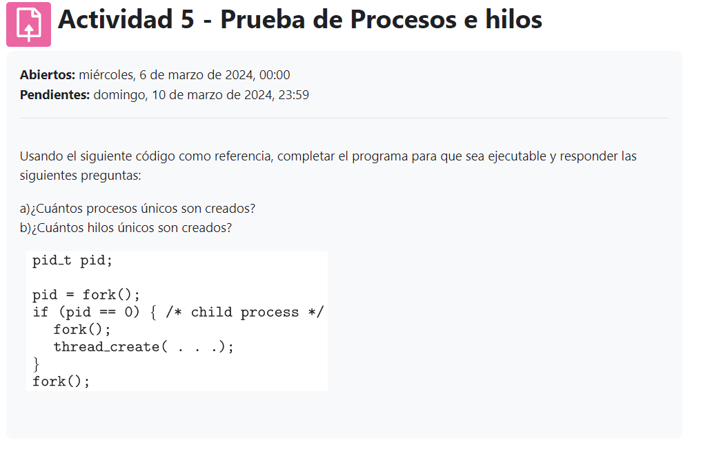
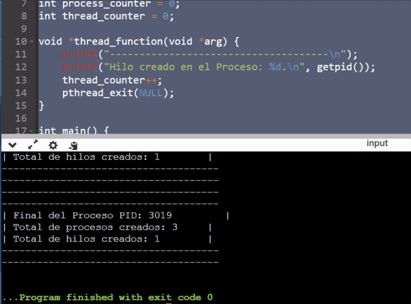

## CREACION DE HILOS

1. Completamos el hilo

   

```javascript
#include <stdio.h>
#include <stdlib.h>
#include <unistd.h>
#include <pthread.h>
#include <sys/wait.h>

int process_counter = 0;
int thread_counter = 0;

void *thread_function(void *arg) {
    printf("-------------------------------------\n");
    printf("Hilo creado en el Proceso: %d.\n", getpid());
    thread_counter++;
    pthread_exit(NULL);
}

int main() {
    pid_t pid;
    pthread_t tid;
    
    printf("-------------------------------------\n");
    printf("Proceso padre. PID: %d\n", getpid());
    process_counter++;
    
    pid = fork();
    if (pid == -1) {
        perror("!!!!Fallo de bifurcacion!!!\n");
        exit(EXIT_FAILURE);
    }
    
    if (pid == 0) { /* child process */
        printf("Proceso Hijo. ChilPID: %d, Proceso Padre PID: %d\n", getpid(), getppid());
        process_counter++;
        fork();
        printf("Despues de la bifurcacion = 0\n");
        pthread_create(&tid, NULL, thread_function, NULL);
        printf("Creacion de hilos\n");
        pthread_join(tid, NULL);
    }
    else {
        printf("Proceso padre antes de la bifurcacion. PID: %d\n", getpid());
        pthread_create(&tid, NULL, thread_function, NULL);
        pthread_join(tid, NULL);
    }
    
    fork();
    process_counter++;
    
    printf("-------------------------------------\n");
    printf("-------------------------------------\n");
    printf("| Final del Proceso PID: %d         |\n", getpid());
    printf("| Total de procesos creados: %d     |\n", process_counter);
    printf("| Total de hilos creados: %d        |\n", thread_counter);
    printf("-------------------------------------\n");
    printf("-------------------------------------\n");
    
    sleep(1); // Espera para asegurar que todos los procesos/hilos hayan finalizado
    
    return 0;
}

```

---

### Explicacion de codigo agregado


---
1. 
```javascript
#include <stdio.h>
#include <stdlib.h>
#include <unistd.h>
#include <pthread.h>
#include <sys/wait.h>
```
Librerias utilizadas.
---

---
2. 
```javascript
int process_counter = 0;
int thread_counter = 0;
```
Contadores generales para llevar un control al final de cuantos hilos y procesos fueron creados.
---

---
3. 
```javascript
void *thread_function(void *arg) {
    printf("-------------------------------------\n");
    printf("Hilo creado en el Proceso: %d.\n", getpid());
    thread_counter++;
    pthread_exit(NULL);
}
```
Funcion para Crear los hilos donde se imprime el id del proceso y se suma un contador de hilos.
---

---
4. 
```javascript
int main() {
    pid_t pid;
    pthread_t tid;
    
    printf("-------------------------------------\n");
    printf("Proceso padre. PID: %d\n", getpid());
    process_counter++;
```
Funcion main donde declaramos nuestos proceso y hilos tambien imprimimos el proceso padre y se suma un contador de procesos.
---

---
5. 
```javascript
pid = fork();
    if (pid == -1) {
        perror("!!!!Fallo de bifurcacion!!!\n");
        exit(EXIT_FAILURE);
    }
```
Se cra la bifurcacion y por si existe un error, muestra mensaje de error y finaliza.
---

---
6. 
```javascript
if (pid == 0) { /* child process */
        printf("Proceso Hijo. ChilPID: %d, Proceso Padre PID: %d\n", getpid(), getppid());
        process_counter++;
        fork();
        printf("Despues de la bifurcacion = 0\n");
        pthread_create(&tid, NULL, thread_function, NULL);
        printf("Creacion de hilos\n");
        pthread_join(tid, NULL);
    }
```
Si no existe el error, entra al if y muestra mensaje donde se creo el proceso hijo del padre,
tambien se hace la suma en el contador de procesos, se hace la nueva bifurcacion, se crea un nuevo hilo y por ultimo se 
espera a que se termine de ejecutar todo.
---

---
7. 
```javascript
else {
        printf("Proceso padre antes de la bifurcacion. PID: %d\n", getpid());
        pthread_create(&tid, NULL, thread_function, NULL);
        pthread_join(tid, NULL);
    }
```
Parecido al anterior solo que aqui se no se crea la nueva bifurcacion y se crea un hilo y espera a que termine de 
ejecutar todo
---

---
8. 
```javascript
    fork();
    process_counter++;
    
    printf("-------------------------------------\n");
    printf("-------------------------------------\n");
    printf("| Final del Proceso PID: %d         |\n", getpid());
    printf("| Total de procesos creados: %d     |\n", process_counter);
    printf("| Total de hilos creados: %d        |\n", thread_counter);
    printf("-------------------------------------\n");
    printf("-------------------------------------\n");
    
    sleep(1); // Espera para asegurar que todos los procesos/hilos hayan finalizado
    
    return 0;
```
Se crea una nueva bifurcacion se suma el proceso al contador, se muestra como un mensaje final con las estadisticas,
y espera un momento para asegurar que todo haya finalizado
---


## Usando el siguiente código como referencia, completar el programa para que sea ejecutable y responder las siguientes preguntas:

## a)¿Cuántos procesos únicos son creados?
### R. 3
## b)¿Cuántos hilos únicos son creados?
### R. 1
