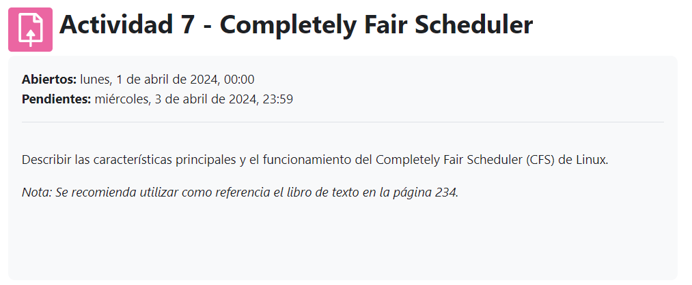
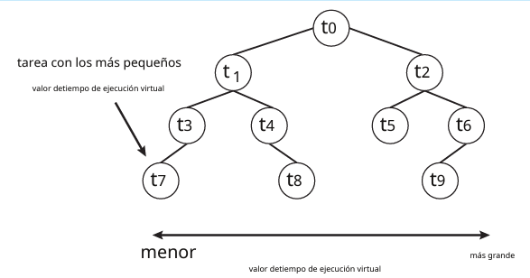
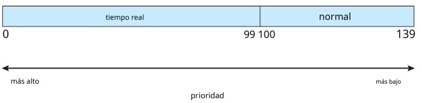
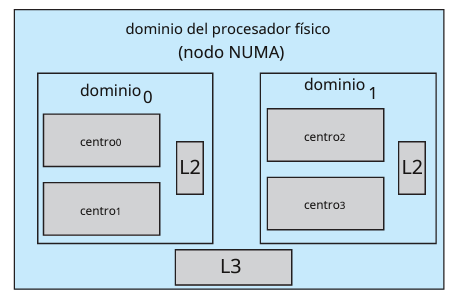

## Actividad 7

### Describir las características principales y el funcionamiento del Completely Fair Scheduler (CFS) de Linux. 
___
#### Nota: Se recomienda utilizar como referencia el libro de texto en la página 234.
___ 

## El completely Fair Scheduler (CFS), es un planificador de procesos  que se utiliza por defecto en Linux desde  la versión 2.6.23 que tiene las siguientes características

1. ### Scheduling classes

Se implementan dos clases de scheduling, una que utiliza el algoritmo  de programación CFS y otra que utiliza programación en tiempo real.

2. ### Asignación proporcional de tiempo de CPU

En lugar de usar  una asignación fija, CFS, que asigna una proporción de tiempo de CPU a cada tarea basada en un valor llamado "nice value". Este valor varía entre -20 y +19. Las tareas con un valor nice menor (o sea negativo) reciben una mayor proporción de tiempo de CPU, ya que tienen mayor prioridad.

3. ### Tiempo virtual

CFS no asigna prioridades directamente, sino que utiliza un concepto de "Tiempo Virtual"(vruntime), para hacer un seguimiento del tiempo de ejecución de cada tarea. En sí, los valores con una mayor prioridad tienen un vruntime que aumenta lentamente y les da una menor prioridad.

4. ### Latencia objetiva.

En lugar de usar los tiempos fijos, se tiene una latencia, que es un intervalo de tiempo durante el cual una tarea debería ejecutarse al menos una vez. Esta latencia puede aumentar si el número de tareas activas crece.

5. ### Árbol red-black

Es un árbol de búsqueda binaria equilibrado cuya clave se basa en el valor de tiempo de ejecución.

6. ### Prioridades

Estas prioridades se asignan del rango 0 al 99 para prioridades estáticas, y del 100 al 139 para las tareas normales. Estos rangos se asignan a un esquema de prioridad global, donde más bajo es el valor, más alta es la prioridad.

7. ### Equilibrios de carga

CFS tiene soporte para equilibrar la carga entre los diferentes núcleos, utiliza una estrategia de jerarquía de "dominios de planificación", que lo que intenta hacer es que en el mismo nodo NUMA se mantengan las tareas.

___